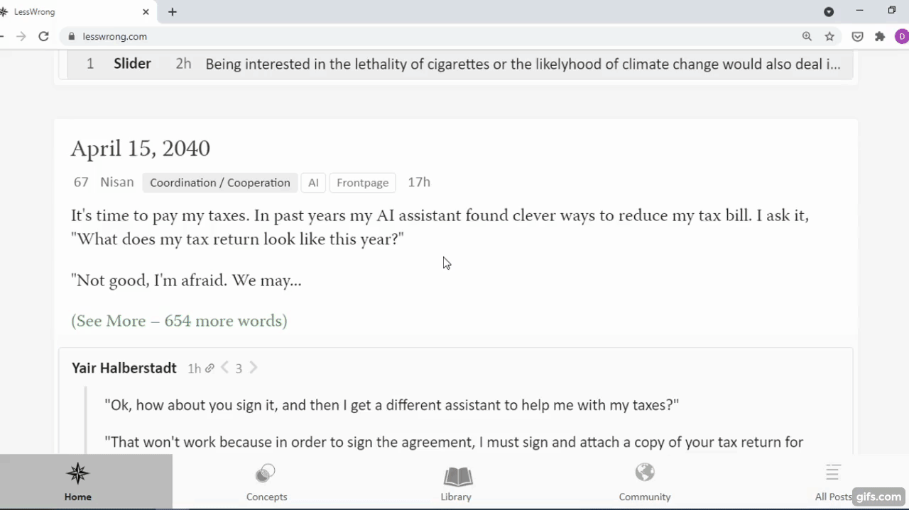

## What is it?
A Chrome Extension that lets you look up english words in popular dictionaries fast.



The available dictionaries are:

+ Macmillan
+ Cambridge
+ Collins
+ Longman

## Installation

1. Download this repository as a ZIP file.
2. Extract the repository from the ZIP file to your preferred location.
3. Enter ```chrome://extensions/``` into the address bar, which will bring you to the Extensions page.
4. Turn on **Developer mode** in the top right corner.
5. Click **Load unpacked** and select the extracted folder.

## Usage

1. Highlight an english word using your left mouse button.
2. Click on the word with the right mouse button.
3. In the popup appeared hover over **English dictionaries** option.
4. You should see five options to choose:
    1. All Dictionaries — searches for the word highlighted in all dictionaires, opening four tabs.
    2. Macmillan, Cambridge, Collins, Longman — search for the word highlighted in the chosen dictionary, opening one tab.
